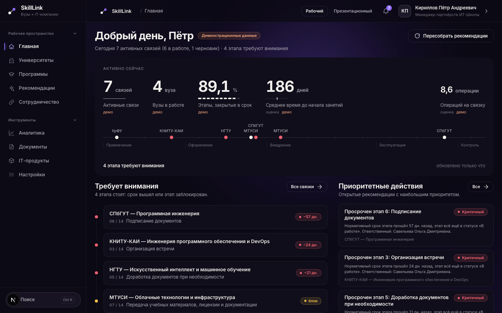
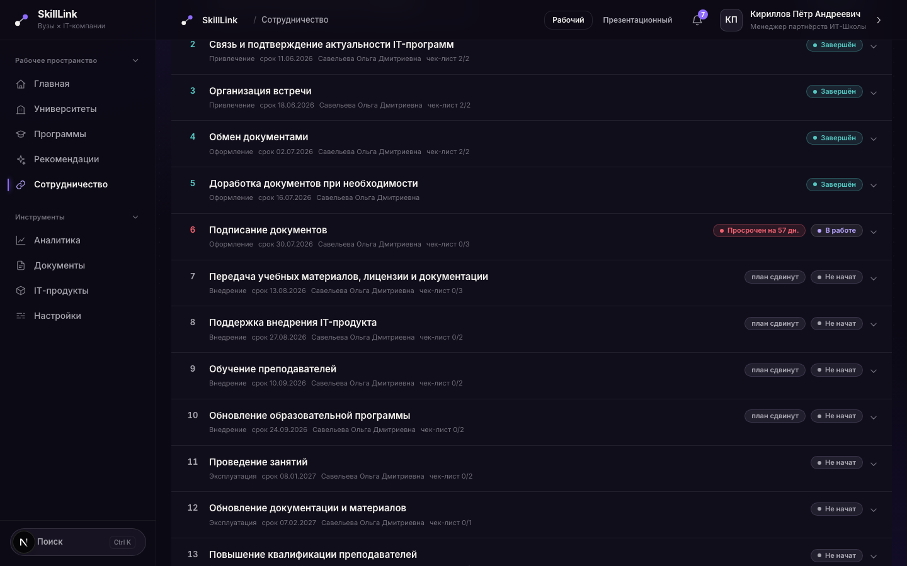

# SkillLink

Рабочая система для IT-компании, которая сотрудничает с вузами: ИТ-Школа РТК приходит
в вуз со своим IT-продуктом — курсом, платформой, лицензией — и доводит сотрудничество
от первого контакта до занятий со студентами.

Единица учёта — **связка** «вуз — образовательная программа — IT-продукт». По каждой связке
система ведёт 14 этапов с чек-листами, сроками и контрольными точками, сама находит,
где работа встала, и объясняет, что сделать, — с обоснованием из данных.



## Что умеет

- **Путь связки из 14 этапов** — от поиска контакта до контроля. Контрольные точки
  (подписание, передача лицензии, занятия) не пускают дальше, пока не закрыто нужное;
  отказ объясняется словами, а не кодом ошибки.
- **Честные сроки.** Просрочен только начатый этап; не начатый со сроком в прошлом —
  «план сдвинут». На главной — одна строка на связку, без повторов одной задержки.
- **Рекомендации с обоснованием** — правила по срокам, застою, дефицитам навыков;
  закрыть рекомендацию, пока проблема есть, нельзя.
- **Аналитика**: рейтинг программ с раскрытием вклада каждого показателя, покрытие
  навыков рынка, воронка связок, тренд за 30 дней. Нет данных — «нет данных», а не ноль.
- **Документы** из шаблонов с реквизитами; подписанный договор сам отмечает этап подписания.
- **Кабинет представителя вуза**: видит только свой вуз, подтверждает получение
  материалов, вносит заявки и численность.
- **ИИ-помощник на российской модели** (YandexGPT, запасной GigaChat): сводка по связке,
  черновик письма вузу, «что сделать сегодня». Решают правила, модель только пишет текст;
  персональные данные в модель не уходят. Без ключа — шаблон из тех же фактов.
- **Импорт и выгрузка** реестров, глобальный поиск, лента событий, журнал действий.



## Попробовать

Стенд: **https://skilllink.site** (Yandex Cloud, данные в РФ). Доступ для экспертов —
в материалах заявки. Все данные на стенде демонстрационные и помечены в интерфейсе.

| Роль | Логин | Кто это | Что видит |
| --- | --- | --- | --- |
| `MANAGER` | `manager@skilllink.demo` | менеджер партнёрств ИТ-Школы | всё, ведёт связки |
| `ADMIN` | `admin@skilllink.demo` | администратор | всё, плюс пользователи, журнал действий и обезличивание контактов |
| `ANALYST` | `analyst@skilllink.demo` | аналитик | аналитика и реестры |
| `VIEWER` | `viewer@skilllink.demo` | руководитель | аналитика и реестры, без правки |
| `UNIVERSITY_REP` | `rep@spbgu.example.invalid` | представитель вуза | только кабинет своего вуза |

Пароль — в описании решения, поданном на конкурс, или у организаторов; здесь и в
презентации намеренно не публикуется (стенд — рабочая система с реальным доступом).

## Проверить за 10 минут

Маршрут для эксперта, который смотрит стенд один, без пояснений рядом —
**https://skilllink.site**:

1. **Вход** — `manager@skilllink.demo`.
2. **Главная** — что горит: связки, вузы в работе, % этапов в срок, время до
   ближайшего события.
3. **Вуз** — реестр «Вузы» → любая карточка → вкладки обзор / программы / связки /
   документы / история.
4. **Связка** — СПбГУТ, программа «Программная инженерия».
5. **Этап** — этап 6 «Подписание документов»: контрольная точка объясняет словами,
   почему дальше нельзя, а не кодом ошибки.
6. **Рекомендация** — раздел «Рекомендации» → у любой открыто обоснование и данные,
   на которых оно построено.
7. **Аналитика** — рейтинг программ с раскрытием вклада каждого из трёх показателей.
8. **Кабинет вуза** — войти `rep@spbgu.example.invalid`: видно только свой вуз,
   остальные вузы и внутренняя аналитика ИТ-Школы недоступны.

Учётки по остальным ролям — в таблице выше. Что мы сознательно не успели показать
кнопкой — раздел «Что не вошло и почему» ниже.

## Быстрый старт

Нужны **Node.js `^20.19`, `^22.12` или `24+`** (Prisma 7 не работает на 20.0–20.18, 21
и 22.0–22.11), PostgreSQL 16 и npm 10+.

```bash
npm install
docker compose up -d postgres        # или локальный PostgreSQL 16
cp .env.example .env
npm run db:deploy                    # миграции
npm run db:seed                      # демонстрационные данные
npm run dev                          # http://localhost:3000
```

Локально пароль всех демо-пользователей — `skilllink`: `manager@skilllink.demo`,
`admin@skilllink.demo`, `analyst@skilllink.demo`, `viewer@skilllink.demo`,
`rep@spbgu.example.invalid`. Windows, Docker-сборка, переменные окружения, интеграции —
[docs/SETUP.md](docs/SETUP.md). Развёртывание на сервере — [docs/DEPLOY.md](docs/DEPLOY.md).

## Стек

Next.js 15 (App Router) и TypeScript strict — интерфейс и API в одном приложении;
PostgreSQL 16 и Prisma 7; Zod на входе каждого маршрута; NextAuth (пароли — bcrypt);
Vitest; Docker и Caddy на Yandex Cloud. Без UI-библиотек и Tailwind: своя дизайн-система
в `src/ui/`.

Модульный монолит: `src/modules/<модуль>/` — схема, сервис, правила, доступ к данным;
маршруты `src/app/api/**` тонкие; поток строго route → service → repo.
Подробно — [docs/ARCHITECTURE.md](docs/ARCHITECTURE.md).

## Проверки

```bash
npm run typecheck && npm test        # типы и модульные тесты
npm run lint                         # ESLint: падает только на настоящих ошибках, стиль — предупреждения
npm run check:docs                   # только сверка документов и конфигов с кодом (входит и в npm test)
npm run smoke                        # сквозной сценарий против запущенного сервера
npm run probe                        # пробник: изоляция ролей, противоречивые состояния, кривой ввод
npm run db:verify                    # правила целостности данных в базе
npm run audit:verify                 # цепочка хешей журнала действий и печати (решение 115); audit:seal — снять печать
TEST_DATABASE_URL=… npx vitest run src/modules/audit/chain.db.test.ts   # цепочка журнала на настоящей базе
npm run demo:check -- <адрес>        # сверка стенда со сценарием показа (только чтение)
npm run recs:simulate                # как рекомендации учатся: 90 дней решений, веса правил (решение 119)
npm run analytics:report             # длительность этапов, воронка, «Система заметила» — цифры для слайда
```

Всё это, плюс сборка и сверка OpenAPI со спецификацией, идёт в CI на каждый PR;
число предупреждений линтера по правилам — в сводке прогона (решение 113).
Спецификация API — `docs/openapi.json` и `GET /api/openapi.json`.

## Безопасность и персональные данные

- Вход по паролю с защитой от подбора, сессия до 8 часов, роли проверяются в каждом
  сервисе; представитель вуза видит только свой вуз.
- Изменяющие запросы с чужим `Origin` отклоняются, защитные заголовки, HTTPS с HSTS.
- Приложение ходит в базу ролью без прав суперпользователя; журнал действий оно может
  только читать и дописывать. Журнал защищён от подмены цепочкой хешей и печатями:
  изменённая, удалённая или переставленная запись видна проверкой (решение 115).
- Политика обработки ПД — `/privacy` (открыта без входа); опись данных, сроки хранения,
  меры и модель угроз — [docs/PRIVACY.md](docs/PRIVACY.md).
- Соответствие 152-ФЗ и приказам ФСТЭК не заявляется: это оценка разработчиков,
  а не заключение аудитора. Что сделано и чего нет — [docs/SECURITY_LIMITATIONS.md](docs/SECURITY_LIMITATIONS.md).

## Документация

| Документ | О чём |
| --- | --- |
| [docs/SETUP.md](docs/SETUP.md) | Установка, запуск, тесты, интеграции — подробно |
| [docs/DEPLOY.md](docs/DEPLOY.md) | Развёртывание и обслуживание стенда |
| [docs/ARCHITECTURE.md](docs/ARCHITECTURE.md) | Архитектура и модули |
| [docs/API_CONTRACT.md](docs/API_CONTRACT.md) | Контракт API: эндпоинты, поля, ошибки, примеры |
| [docs/DATABASE_SCHEMA.md](docs/DATABASE_SCHEMA.md) | Схема базы |
| [docs/DATABASE_ANSWERS.md](docs/DATABASE_ANSWERS.md) | База данных: короткие ответы экспертам |
| [docs/ANALYTICS_METHODOLOGY.md](docs/ANALYTICS_METHODOLOGY.md) | Формулы и коэффициенты аналитики |
| [docs/ANALYTICS_MODEL.md](docs/ANALYTICS_MODEL.md) | Аналитика этапов на статистике: Каплан–Мейер, порог застоя, воронка, «Система заметила» |
| [docs/PRIVACY.md](docs/PRIVACY.md) | Персональные данные и 152-ФЗ |
| [docs/SECURITY_LIMITATIONS.md](docs/SECURITY_LIMITATIONS.md) | Безопасность: что сделано, чего нет |
| [docs/FRONTEND.md](docs/FRONTEND.md) | Интерфейс и дизайн-система |
| [docs/GLOSSARY.md](docs/GLOSSARY.md) | Словарь терминов: как называть вещи в интерфейсе |
| [docs/TECHNICAL_DECISIONS.md](docs/TECHNICAL_DECISIONS.md) | Журнал технических решений |
| [docs/PROGRESS.md](docs/PROGRESS.md) | Состояние, риски, что дальше |

Требования: [docs/tz/skilllink-tz.md](docs/tz/skilllink-tz.md), [docs/concept.md](docs/concept.md).

## Как мы работали

- **Артур** — сбор и фиксация требований, декомпозиция задач, контроль сроков и приёмка
  результатов, коммуникация с заказчиком, демонстрационный сценарий и защита.
- **Тигран** — структура данных: схема, миграции, справочники, представления и запросы
  для рейтинга программ и сопоставления навыков с рынком.
- **Иван и Сергей** — дизайн-система и интерфейс: реестры, карточка связки, кабинет
  представителя вуза, дашборд.
- **Сергей** — серверная часть: API, машина состояний этапов, документы, ролевая модель,
  журналирование, спецификация OpenAPI, контейнеризация и развёртывание.

Роли — [docs/concept.md](docs/concept.md). Решения PM по продукту и процессу, с датой
и причиной, — [docs/DECISIONS.md](docs/DECISIONS.md); технические решения (архитектура,
альтернативы, что проверено) — [docs/TECHNICAL_DECISIONS.md](docs/TECHNICAL_DECISIONS.md),
по решение 139 включительно (26.09.2026).

**Как проверялось:** CI на каждый PR (типы, тесты, сборка, сверка документов и OpenAPI
с кодом), сквозной сценарий (`npm run smoke`), пробник по правам и краевым случаям
(`npm run probe`), правила целостности данных (`npm run db:verify`), сверка живого стенда
со сценарием показа (`npm run demo:check`) — и ручные проходы по интерфейсу перед каждой
сдачей.

**Честно про ИИ:** значительная часть кода написана с помощью ИИ-ассистента (Claude Code)
по заданиям команды — мы это не скрываем. Архитектурные решения, правила процесса и
спорные случаи — в журналах решений выше, их больше сотни, каждое с обоснованием.
Любое изменение проходит те же проверки, что и написанное руками: типы, тесты, линт,
сквозной сценарий, пробник — и приёмку PM перед вливанием в `main`.

Хакатон IT Школы РТК, 2026.

## Что не вошло и почему

Коротко, без пересказа: часть пунктов ТЗ и концепции сознательно не сделана к сдаче —
приоритет отдан объяснимости данных и контрольным точкам, а не полноте экрана. Полный
список ограничений и обоснование — [docs/SECURITY_LIMITATIONS.md](docs/SECURITY_LIMITATIONS.md)
(политики доступа на уровне строк — P2, второй фактор входа, копии вне сервера и другое)
и [docs/PRIVACY.md](docs/PRIVACY.md), раздел 11 «Что не сделано — честно» (учёт согласий
по всем контактам, продление срока ответа субъекту ПД и другое). Что не вошло во фронт
при готовом API — раздел «Не успели» в [docs/PROGRESS.md](docs/PROGRESS.md).

## Масштаб на 29.09

| Что | Число |
| --- | --- |
| Моделей в схеме (`prisma/schema.prisma`) | 42 |
| Миграций (`prisma/migrations`) | 25 |
| Маршрутов API (`src/app/api/**/route.ts`) | 128 |
| Операций в спецификации (`docs/openapi.json`) | 154 |
| Тестов (`npm test`) | 3018 (3000 выполняются, 18 пропущено — 16 требуют TEST_DATABASE_URL, 2 — маршруты без отдельного описания) |
| Правил целостности данных (`npm run db:verify`) | 36 (46 с демо-набором) |
| Проверок сквозного сценария (`npm run smoke`) | 350 |
| Проверок пробника (`npm run probe`) | 584 |
| Пунктов сверки со сценарием показа (`npm run demo:check`) | 27 |

Число моделей, миграций, маршрутов и операций держит зелёным
`src/shared/openapi/docs-counts.test.ts`: расхождение с кодом роняет сборку, а не
остаётся тихой опечаткой. Остальные строки — из прогона на 26.09.2026; при последующих
изменениях сверяются заново тем же способом (`npm test`, `npm run db:verify`,
`npm run smoke`, `npm run probe`, `npm run demo:check`).

## Лицензия

[MIT](LICENSE)
