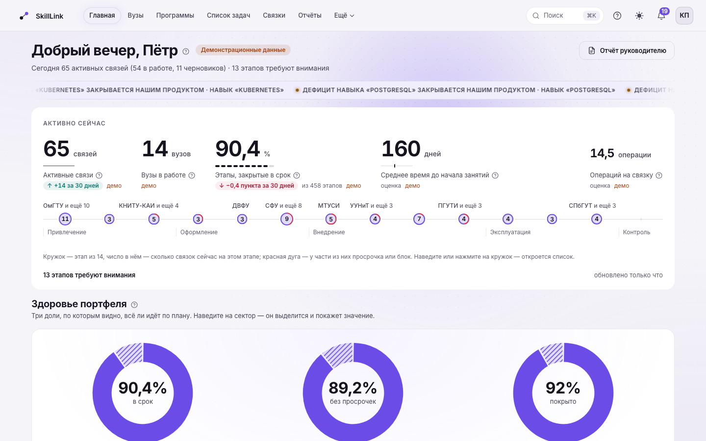
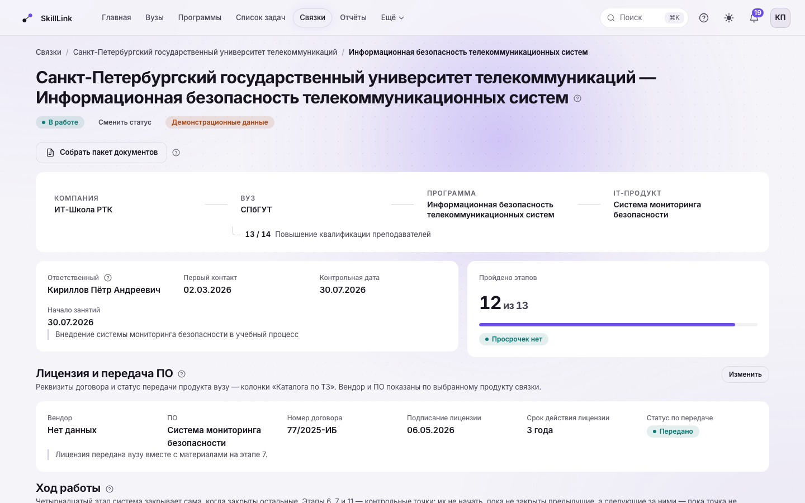

**Сопроводительная документация (PDF):** [SkillLink — сопроводительная документация.pdf](https://github.com/arturvar96355-spec/skilllink/blob/main/docs/SkillLink%20%E2%80%94%20%D1%81%D0%BE%D0%BF%D1%80%D0%BE%D0%B2%D0%BE%D0%B4%D0%B8%D1%82%D0%B5%D0%BB%D1%8C%D0%BD%D0%B0%D1%8F%20%D0%B4%D0%BE%D0%BA%D1%83%D0%BC%D0%B5%D0%BD%D1%82%D0%B0%D1%86%D0%B8%D1%8F.pdf)

**Видео:** ссылка появится 29.09

**Документация по использованию (без входа):** https://skilllink.site/docs

# SkillLink

Рабочая система для IT-компании, которая сотрудничает с вузами: ИТ-Школа РТК приходит
в вуз со своим IT-продуктом — курсом, платформой, лицензией — и доводит сотрудничество
от первого контакта до занятий со студентами.

## С чего начать

1. **Стенд и вход эксперта в один клик** — https://skilllink.site: на странице входа
   первым стоит блок «Вход для экспертов хакатона», кнопки «Менеджер», «Администратор»,
   «Представитель вуза» — без пароля, только просмотр ([«Попробовать»](#попробовать)).
2. **Проверить за 10 минут** — маршрут по ядру системы: [«Проверить за 10 минут»](#проверить-за-10-минут).
3. **Пункт ТЗ → где смотреть** — экран, маршрут API и решение по каждому пункту:
   [docs/TZ_COMPLIANCE.md](docs/TZ_COMPLIANCE.md).
4. **Документация** — https://skilllink.site/docs (открыта без входа; внутри системы —
   тот же текст в `/help` и «?» у каждого экрана).
5. **Swagger и архитектура** — Swagger UI [`skilllink.site/api-docs`](https://skilllink.site/api-docs)
   (после входа; спецификация без входа — [`/api/openapi.json`](https://skilllink.site/api/openapi.json)),
   архитектура — [docs/ARCHITECTURE.md](docs/ARCHITECTURE.md) и модель Archi
   [docs/SkillLink-architecture.archimate](docs/SkillLink-architecture.archimate).

Данные на стенде синтетические: названия вузов-партнёров настоящие, а люди и контакты
вымышлены и помечены в интерфейсе как демонстрационные. Код — лицензия [MIT](LICENSE); лицензии сторонних
библиотек — [docs/THIRD_PARTY_LICENSES.md](docs/THIRD_PARTY_LICENSES.md). Авторы —
раздел [«Как мы работали»](#как-мы-работали).

Единица учёта — **связка** «вуз — образовательная программа — IT-продукт». По каждой связке
система ведёт 14 этапов с чек-листами, сроками и контрольными точками, сама находит,
где работа встала, и объясняет, что сделать, — с обоснованием из данных.

SkillLink — главный источник по связкам «вуз × программа × продукт» и их этапам: здесь
одна правда о том, кто с кем на каком шаге. Не главный источник для договоров (их ведёт
СЭД), персональных данных студентов (SkillLink их не хранит) и учётных записей
сотрудников (единый вход — Keycloak организации, раздел «Что умеет»).



## Что умеет

- **Путь связки из 14 этапов** — от поиска контакта до контроля. Контрольные точки
  (подписание, передача лицензии, занятия) не пускают дальше, пока не закрыто нужное;
  отказ объясняется словами, а не кодом ошибки.
- **Честные сроки.** Просрочен только начатый этап; не начатый со сроком в прошлом —
  «план сдвинут». На главной — одна строка на связку, без повторов одной задержки.
- **«Список задач» с обоснованием** (бывшие «Рекомендации», решение 212) — правила по
  срокам, застою, дефицитам навыков; закрыть задачу, пока проблема есть, нельзя.
- **«Рекомендации продуктов»** (решение 223) — какой IT-продукт предложить программе
  вуза по дефицитам навыков, с причинами и черновиком письма.
- **Уведомления**: колокольчик в системе, Telegram и VK подключены; MAX готов в коде,
  для отправки нужен токен организации.
- **Аналитика**: рейтинг программ с раскрытием вклада каждого показателя, покрытие
  навыков рынка, воронка связок, тренд за 30 дней. Нет данных — «нет данных», а не ноль.
- **Документы** из шаблонов с реквизитами; подписанный договор сам отмечает этап подписания.
- **Кабинет представителя вуза**: видит только свой вуз, подтверждает получение
  материалов, вносит заявки и численность.
- **ИИ-помощник на российской модели** (YandexGPT, запасной GigaChat): сводка по связке,
  черновик письма вузу, «что сделать сегодня». Решают правила, модель только пишет текст;
  перед отправкой в модель почта, телефоны, паспорт, СНИЛС и известные системе ФИО
  скрываются ([AI_ASSISTANT.md](docs/AI_ASSISTANT.md)). Без ключа — шаблон из тех же фактов.
- **Импорт и выгрузка** реестров, глобальный поиск, лента событий, журнал действий.
- **Вход**: пароль (bcrypt, защита от перебора) и единый вход через **Keycloak** (решение 188) —
  на стенде включён, кнопка «Войти через Keycloak» (единый вход для сотрудников РТК) на странице входа. Права решает база
  SkillLink, а не способ входа ([ARCHITECTURE.md](docs/ARCHITECTURE.md), «Авторизация и Keycloak»).



## Попробовать

Стенд: **https://skilllink.site** (Yandex Cloud, данные в РФ). Доступ для экспертов —
в материалах заявки. Все данные на стенде демонстрационные и помечены в интерфейсе.

| Роль | Логин | Кто это | Что видит |
| --- | --- | --- | --- |
| `MANAGER` | `manager@skilllink.demo` | менеджер партнёрств ИТ-Школы | всё, ведёт связки |
| `HEAD` | `head@skilllink.demo` | руководитель направления сотрудничества с вузами | всё, что менеджер, плюс назначение и смена ответственного по вузу и связке (решение 146) |
| `ADMIN` | `admin@skilllink.demo` | администратор | всё, плюс пользователи, журнал действий и обезличивание контактов |
| `ANALYST` | `analyst@skilllink.demo` | аналитик | аналитика и реестры |
| `VIEWER` | `viewer@skilllink.demo` | наблюдатель | аналитика и реестры, без правки |
| `UNIVERSITY_REP` | `rep@spbgu.example.invalid` | представитель вуза | только кабинет своего вуза |

Пароль — в описании решения, поданном на конкурс, или у организаторов; здесь и в
презентации намеренно не публикуется (стенд — рабочая система с реальным доступом).

**Отдельные учётные записи для экспертов конкурса** (решение 147) — у учётных записей
экспертов свой пароль (только чтение), передаётся в файле на платформе конкурса
(решение 228): он не открывает `admin@` и `manager@`. Разрушающие и изменяющие
действия сервер отклоняет независимо от роли (403 «Недоступно
в учётной записи эксперта: действие необратимо»): удаление, архивирование, обезличивание,
слияние, блокировка и смена роли пользователей, загрузка и удаление файлов, импорт и
похожее. Экспертам открыты чтение и выгрузки — этого достаточно, чтобы посмотреть систему
и ничего в ней не сломать.

| Роль | Логин | Что видит |
| --- | --- | --- |
| `MANAGER` | `expert-manager@skilllink.demo` | всё, что менеджер, без права менять |
| `ADMIN` | `expert-admin@skilllink.demo` | то же, что администратор, кроме журнала действий, пользователей и запросов субъектов ПД — без права менять |
| `UNIVERSITY_REP` | `expert-rep@skilllink.demo` | кабинет вуза СПбГУТ, без права подтверждать за вуз |

**Вход в эти три учётные записи — в один клик** (решение 176): на странице входа под
формой — кнопки с их названиями, пароль вводить не нужно. Кнопки видны, только когда на
стенде включена переменная `EXPERT_QUICK_LOGIN`, и сервер на каждый клик заново проверяет
по базе, что это действительно одна из учётных записей эксперта — обычным входом это не
воспользоваться, даже зная адрес почты.

## Проверить за 10 минут

Маршрут для эксперта, который смотрит стенд один, без пояснений рядом —
**https://skilllink.site**:

1. **Вход** — кнопка «Менеджер» в блоке «Вход для экспертов хакатона» (только просмотр);
   нажать переход этапа самому — `manager@skilllink.demo` с паролем из файла на платформе конкурса.
2. **Главная** — что горит: связки, вузы в работе, % этапов в срок, время до
   ближайшего события.
3. **Вуз** — реестр «Вузы» → любая карточка → вкладки обзор / программы / связки /
   документы / история.
4. **Связка** — СПбГУТ, программа «Программная инженерия».
5. **Этап** — этап 6 «Подписание документов»: контрольная точка объясняет словами,
   почему дальше нельзя, а не кодом ошибки.
6. **Рекомендация** — раздел «Список задач» (бывшие «Рекомендации», решение 212) → у любой открыто обоснование и данные,
   на которых оно построено.
7. **Аналитика** — рейтинг программ с раскрытием вклада каждого из трёх показателей.
8. **Кабинет вуза** — войти `rep@spbgu.example.invalid`: видно только свой вуз,
   остальные вузы и внутренняя аналитика ИТ-Школы недоступны.

Учётки по остальным ролям — в таблице выше. Что мы сознательно не успели показать
кнопкой — раздел «Границы и план» ниже.

## Быстрый старт

Нужны **Node.js `^20.19`, `^22.12` или `24+`** (Prisma 7 не работает на 20.0–20.18, 21
и 22.0–22.11), PostgreSQL 16 и npm 10+.

```bash
npm install
docker compose up -d postgres        # или локальный PostgreSQL 16
cp .env.example .env
npm run db:deploy                    # миграции
npm run db:seed                      # демонстрационные данные
npm run dev                          # http://localhost:3000
```

Локально пароль демо-пользователей — `skilllink`: `manager@skilllink.demo`,
`admin@skilllink.demo`, `analyst@skilllink.demo`, `viewer@skilllink.demo`,
`rep@spbgu.example.invalid`; у экспертов `expert-*@skilllink.demo` — `skilllink-expert`
(`SEED_EXPERT_PASSWORD`). На стенде оба пароля случайные, их заводит `scripts/deploy/deploy.sh`. Windows, Docker-сборка, переменные окружения, интеграции —
[docs/SETUP.md](docs/SETUP.md). Развёртывание на сервере — [docs/DEPLOY.md](docs/DEPLOY.md).

## Стек

Next.js 15 (App Router) и TypeScript strict — интерфейс и API в одном приложении;
PostgreSQL 16 и Prisma 7; Zod на входе каждого маршрута; NextAuth (пароли — bcrypt);
Vitest; Docker и Caddy на Yandex Cloud. Без UI-библиотек и Tailwind: своя дизайн-система
в `src/ui/`.

Модульный монолит: `src/modules/<модуль>/` — схема, сервис, правила, доступ к данным;
маршруты `src/app/api/**` тонкие; поток строго route → service → repo.
Подробно — [docs/ARCHITECTURE.md](docs/ARCHITECTURE.md).

## Проверки

```bash
npm run typecheck && npm test        # типы и модульные тесты
npm run lint                         # ESLint: падает только на настоящих ошибках, стиль — предупреждения
npm run check:docs                   # только сверка документов и конфигов с кодом (входит и в npm test)
npm run smoke                        # сквозной сценарий против запущенного сервера
npm run probe                        # пробник: изоляция ролей, противоречивые состояния, кривой ввод
npm run db:verify                    # правила целостности данных в базе
npm run audit:verify                 # цепочка хешей журнала действий и печати (решение 115); audit:seal — снять печать
TEST_DATABASE_URL=… npx vitest run src/modules/audit/chain.db.test.ts   # цепочка журнала на настоящей базе
npm run demo:check -- <адрес>        # сверка стенда со сценарием показа (только чтение)
npm run recs:simulate                # как рекомендации учатся: 90 дней решений, веса правил (решение 119)
npm run analytics:report             # длительность этапов, воронка, «Система заметила» — цифры для слайда
```

Всё это, плюс сборка и сверка OpenAPI со спецификацией, идёт в CI на каждый PR;
число предупреждений линтера по правилам — в сводке прогона (решение 113).
Спецификация API — `docs/openapi.json` и `GET /api/openapi.json`.

## Безопасность и персональные данные

- Вход по паролю с защитой от подбора, сессия до 8 часов, роли проверяются в каждом
  сервисе; представитель вуза видит только свой вуз.
- Изменяющие запросы с чужим `Origin` отклоняются, защитные заголовки, HTTPS с HSTS.
- Приложение ходит в базу ролью без прав суперпользователя; журнал действий оно может
  только читать и дописывать. Журнал защищён от подмены цепочкой хешей и печатями:
  изменённая, удалённая или переставленная запись видна проверкой (решение 115).
- Политика обработки ПД — `/privacy` (открыта без входа); опись данных, сроки хранения,
  меры и модель угроз — [docs/PRIVACY.md](docs/PRIVACY.md).
- Соответствие 152-ФЗ и приказам ФСТЭК не заявляется: это оценка разработчиков,
  а не заключение аудитора. Что сделано и чего нет — [docs/SECURITY_LIMITATIONS.md](docs/SECURITY_LIMITATIONS.md).

## Документация

| Документ | О чём |
| --- | --- |
| [docs/USER_GUIDE.md](docs/USER_GUIDE.md) | **Руководство пользователя** — тот же текст, что на https://skilllink.site/docs (без входа) |
| [docs/SETUP.md](docs/SETUP.md) | Установка, запуск, тесты, интеграции — подробно |
| [docs/DEPLOY.md](docs/DEPLOY.md) | Развёртывание и обслуживание стенда |
| [docs/ARCHITECTURE.md](docs/ARCHITECTURE.md) | Архитектура и модули |
| [Сопроводительная документация (PDF)](docs/SkillLink%20—%20сопроводительная%20документация.pdf) | **Документ для сдачи по п. 10 ТЗ**; исходник — [Markdown](docs/SkillLink%20—%20сопроводительная%20документация.md) |
| [docs/TZ_COMPLIANCE.md](docs/TZ_COMPLIANCE.md) | **Соответствие ТЗ РТК: пункт → экран, API, решение** |
| [docs/THIRD_PARTY_LICENSES.md](docs/THIRD_PARTY_LICENSES.md) | Лицензии сторонних библиотек |
| [docs/API_CONTRACT.md](docs/API_CONTRACT.md) | Контракт API: эндпоинты, поля, ошибки, примеры |
| [docs/DATABASE_SCHEMA.md](docs/DATABASE_SCHEMA.md) | Схема базы |
| [docs/DATABASE_ANSWERS.md](docs/DATABASE_ANSWERS.md) | База данных: короткие ответы экспертам |
| [docs/ANALYTICS_METHODOLOGY.md](docs/ANALYTICS_METHODOLOGY.md) | Формулы и коэффициенты аналитики |
| [docs/ANALYTICS_MODEL.md](docs/ANALYTICS_MODEL.md) | Аналитика этапов на статистике: Каплан–Мейер, порог застоя, воронка, «Система заметила» |
| [docs/PRIVACY.md](docs/PRIVACY.md) | Персональные данные и 152-ФЗ |
| [docs/SECURITY_LIMITATIONS.md](docs/SECURITY_LIMITATIONS.md) | Безопасность: что сделано, чего нет |
| [docs/FRONTEND.md](docs/FRONTEND.md) | Интерфейс и дизайн-система |
| [docs/GLOSSARY.md](docs/GLOSSARY.md) | Словарь терминов: как называть вещи в интерфейсе |
| [docs/TECHNICAL_DECISIONS.md](docs/TECHNICAL_DECISIONS.md) | Журнал технических решений |
| [docs/PROGRESS.md](docs/PROGRESS.md) | Состояние, риски, что дальше |

Требования: [docs/tz/skilllink-team-tz.md](docs/tz/skilllink-team-tz.md), [docs/concept.md](docs/concept.md).
Соответствие ТЗ проверяется по официальному документу заказчика; файлы в `docs/tz/` —
проектное ТЗ команды, а не официальный документ — см. [docs/TZ_COMPLIANCE.md](docs/TZ_COMPLIANCE.md).

## Как мы работали

Роли и логины — по фактической истории коммитов (`git shortlog -sne`), не выдуманные:

- **Артур Варданян** (GitHub [arturvar96355-spec](https://github.com/arturvar96355-spec), владелец
  репозитория) — капитан, продукт-менеджер: постановка задач, приёмка, документация и материалы
  к сдаче. Работа в основном вне коммитов в `main`, поэтому в `git shortlog` не виден.
- **Сергей Старков** (GitHub `Incha1ns`) — бэкенд, деплой и безопасность, младший менеджер:
  API, схема и миграции, этапы, контейнеризация и развёртывание; постановка задач ИИ-агентам
  и приёмка результата.
- **Сергей Боровицкий** (GitHub `pels18`) — дизайн и фронтенд.
- **Иван Марьин** — дизайн, фронтенд, демо; без коммитов в `main`.
- **Тигран Кагян** (GitHub `Tigraaan`) — база данных и тесты.

Решения PM по продукту и процессу, с датой и причиной, — [docs/DECISIONS.md](docs/DECISIONS.md);
технические решения (архитектура, альтернативы, что проверено) — весь журнал в
[docs/TECHNICAL_DECISIONS.md](docs/TECHNICAL_DECISIONS.md) (не фиксируем номер последней
записи здесь, чтобы строка не расходилась с журналом при каждом новом решении).

**Честно про ИИ.** Основной объём кода написан ИИ-ассистентом (Claude Code) по заданиям
команды — задачу, контекст и критерии приёмки формулировал человек, результат проверяли
CI и человек перед вливанием в `main`. Контроль: CI на каждый PR (типы, тесты, сборка,
сверка OpenAPI и документов с кодом), сверка живого стенда со сценарием показа перед
выкладкой, журнал решений на каждую спорную развилку. Обязательное ревью каждого PR
человеком на время хакатона заменено обязательными проверками CI — сроки не позволяли
держать оба; после сдачи обязательное ревью возвращается.

Хакатон IT Школы РТК, 2026.

## Границы и план

Коротко, без пересказа: часть пунктов ТЗ и концепции сознательно не сделана к сдаче —
приоритет отдан объяснимости данных и контрольным точкам, а не полноте экрана. Три
самых заметных ограничения и что с ними делать дальше:

- **LMS, сайт и почта — без живого подключения.** API приёма готово (`POST
  /api/import/external`, `POST /api/inbound-letters/upload`), но ни одна интеграция не
  подключена к системе заказчика: контракт с его стороны не согласован. Как включить —
  [docs/SETUP.md](docs/SETUP.md), раздел «Интеграции».
- **Демо-данные синтетические, связки не реальные.** Названия вузов настоящие, но люди,
  контакты и связки вымышлены. Помечены `isMock` в каждом
  ответе API и значком в интерфейсе, за реальные не выдаются. Для пилота — готовый
  импорт каталогов из Excel/CSV (`POST /api/import/vendors`), начать можно без правок кода.
- **Контрольная точка не настраивается через интерфейс.** Этапы 6, 7 и 11 зашиты в
  `CONTROL_POINT_STAGES`, потому что от их порядка зависят проверки перехода, а не
  только подпись строки в базе. Обоснование каждой — [docs/CONTROL_POINTS.md](docs/CONTROL_POINTS.md).

Полный список ограничений — [docs/SECURITY_LIMITATIONS.md](docs/SECURITY_LIMITATIONS.md)
(политики доступа на уровне строк — P2, второй фактор входа и другое)
и [docs/PRIVACY.md](docs/PRIVACY.md), раздел 11 «Что не сделано — честно» (учёт согласий
по всем контактам, продление срока ответа субъекту ПД и другое). Что не вошло во фронт
при готовом API — раздел «Не сделано» в [docs/PROGRESS.md](docs/PROGRESS.md).

## Масштаб на 29.09

| Что | Число |
| --- | --- |
| Моделей в схеме (`prisma/schema.prisma`) | 51 |
| Миграций (`prisma/migrations`) | 34 |
| Маршрутов API (`src/app/api/**/route.ts`) | 168 |
| Операций в спецификации (`docs/openapi.json`) | 203 |
| Тестов (`npm test`) | 5639 (5621 выполняются, 18 пропущено — 16 требуют TEST_DATABASE_URL, 2 — маршруты без отдельного описания) |
| Правил целостности данных (`npm run db:verify`) | 40 (51 с демо-набором) |
| Проверок сквозного сценария (`npm run smoke`) | 350 |
| Проверок пробника (`npm run probe`) | 587 |
| Пунктов сверки со сценарием показа (`npm run demo:check`) | 35 |
| Полнота демо-данных (`npm run demo:coverage`) | 51 модель, 0 пустых содержательных таблиц |

Число моделей, миграций, маршрутов и операций держит зелёным
`src/shared/openapi/docs-counts.test.ts`: расхождение с кодом роняет сборку, а не
остаётся тихой опечаткой. Число тестов сверено `npx vitest run` при решении 231
(28.09.2026). Строки `db:verify` и `demo:check` пересчитаны тогда же по коду
(`scripts/db-verify.ts`, `scripts/demo-check.ts`) — без живой базы, точечной правкой
документов это и ограничено. Строки про `smoke`, `probe` и
`demo:coverage` — из прогона на 26.09.2026 (решение 141), а не пересчитаны заново
здесь: это прогоны против поднятой базы и dev-сервера, вне точечной правки.
При последующих изменениях все строки сверяются заново тем же способом (`npm test`,
`npm run db:verify`, `npm run smoke`, `npm run probe`, `npm run demo:check`,
`npm run demo:coverage`).

## Лицензия

[MIT](LICENSE), © 2026 Команда SkillLink. Лицензии сторонних библиотек —
[docs/THIRD_PARTY_LICENSES.md](docs/THIRD_PARTY_LICENSES.md).
