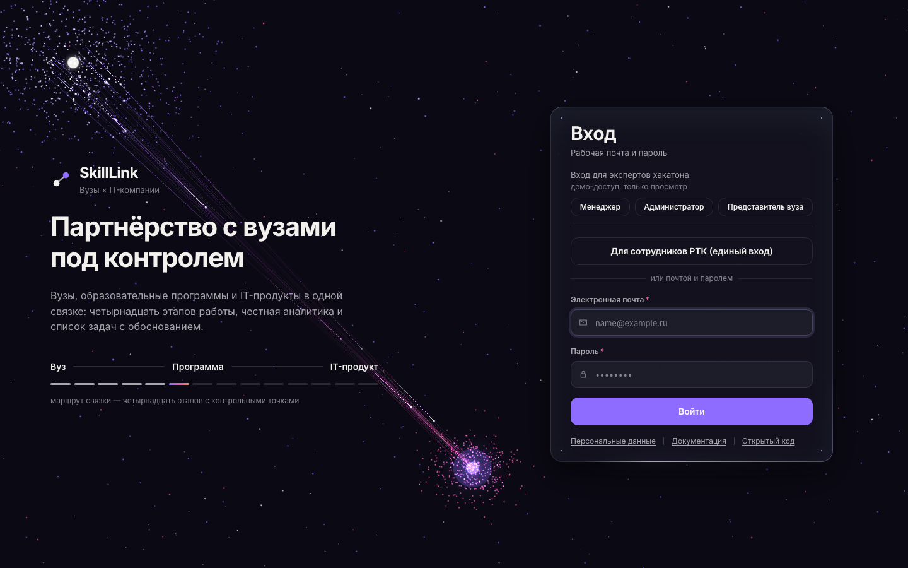
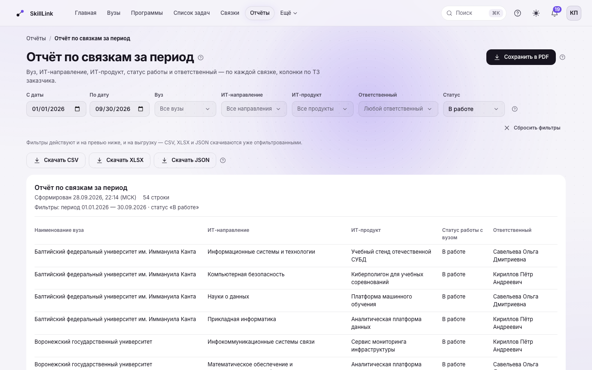

# SkillLink — сопроводительная документация

Система контроля и обработки статистических данных по обучению студентов вузов по
ИТ-направлениям для ИТ-Школы РТК. Решение команды SkillLink для хакатона ИТ-Школы РТК
(«Лидеры цифровой трансформации 2026»), версия 1.0.0, 29.09.2026.

| Что | Где |
| --- | --- |
| Работающая система (стенд) | https://skilllink.site |
| Документация по использованию, без входа | https://skilllink.site/docs |
| Исходный код (лицензия MIT) | https://github.com/arturvar96355-spec/skilllink |
| Соответствие ТЗ построчно | `docs/TZ_COMPLIANCE.md` в репозитории |
| Swagger UI (после входа) | https://skilllink.site/api-docs |

Все данные на стенде синтетические: вузы-партнёры, люди и контакты вымышлены и
помечены в интерфейсе как демонстрационные.

## 1. Обзор решения

**Задача.** ИТ-Школа РТК приходит в вуз со своим IT-продуктом — курсом, платформой,
лицензией — и доводит сотрудничество от первого контакта до занятий со студентами.
Сейчас это ведётся в таблицах и переписке: не видно, какая работа с вузом застряла и
на каком шаге, вузы и программы нельзя сравнить, неясно, каким навыкам вузы учат
относительно того, что требует рынок.

**Решение.** Единица учёта — **связка** «вуз — образовательная программа — IT-продукт».
По каждой связке система ведёт путь из 14 этапов с чек-листами, сроками и тремя
контрольными точками (подписание документов, передача лицензии, начало занятий). Пока
условие контрольной точки не выполнено, дальше пройти нельзя — и система объясняет
словами, чего не хватает. Она сама находит, где работа встала, и собирает
«Список задач» с обоснованием из данных.

**Пользователи и роли.** Шесть ролей: менеджер по вузам (КАМ, около 20 человек),
руководитель (назначает и меняет ответственных), администратор платформы — три роли ТЗ;
плюс аналитик, наблюдатель и представитель вуза (видит только кабинет своего вуза).
Права проверяет сервер в каждом запросе, а не только интерфейс.

## 2. Доступ для экспертов

**Вход в один клик — только чтение.** На странице входа https://skilllink.site/login
первым стоит блок «Вход для экспертов хакатона» с кнопками «Менеджер», «Администратор»,
«Представитель вуза» (подпись «демо-доступ, только просмотр»). Пароль не нужен. Эти
учётные записи видят всё, что видит роль, и могут выгружать данные, но любое изменение
сервер отклоняет (403 «Недоступно в учётной записи эксперта»). Кнопка ниже — «Для
сотрудников РТК (единый вход)» — вход через Keycloak; эксперту она не нужна.

**Проверить контрольную точку руками.** Чтобы самому нажать переход этапа и увидеть
отказ контрольной точки, войдите обычной формой как `manager@skilllink.demo` — пароль в
файле на платформе конкурса. Маршрут: «Связки» → СПбГУТ, программа «Программная
инженерия» → этап 6 «Подписание документов» — система объясняет, почему дальше нельзя.
Тот же отказ показан в видео решения. У учётных записей экспертов свой пароль (только
чтение), он тоже в файле на платформе и не открывает учётные записи сотрудников.

**Маршрут на 10 минут.** Главная (что требует внимания) → карточка вуза → связка →
этап 6 (контрольная точка) → «Список задач» (обоснование каждой задачи) → «Аналитика»
(рейтинг программ с раскрытием вклада показателей) → «Отчёты» (фильтры и выгрузка) →
кабинет вуза (кнопка «Представитель вуза»: видно только свой вуз).

## 3. Что умеет система

- **Путь связки из 14 этапов** — от поиска контакта до контроля выполнения. Контрольные
  точки 6, 7 и 11 не пускают дальше, пока не закрыто нужное; отказ — словами.
- **Честные сроки.** Просрочен только начатый этап; не начатый со сроком в прошлом —
  «план сдвинут». На главной — одна строка на связку, без повторов одной задержки.
- **«Список задач»** (прежнее название — «Рекомендации») — правила по срокам, застою и
  дефицитам навыков; у каждой задачи — почему она появилась и на каких данных. Закрыть
  задачу, пока проблема есть, нельзя.
- **«Рекомендации продуктов»** — какой IT-продукт предложить программе вуза: балл по
  дефицитам навыков, причины данными, черновик письма-предложения. Вкладка
  «Аналитика → Рекомендации продуктов» и блок «Что предложить вузу» в карточках.
- **Аналитика** — рейтинг программ с раскрытием вклада каждого показателя, покрытие
  навыков рынка, воронка связок с выбывшими, узкие места этапов, тепловая карта встреч.
  Нет данных — «нет данных», а не ноль.
- **Отчёты** — «Отчёт по связкам за период» и «Каталог лицензий и передачи ПО» с
  колонками по ТЗ, фильтрами по периоду, вузу, направлению, продукту, ответственному и
  статусу; выгрузка CSV, XLSX, JSON, PDF.
- **Документы и файлы** — документы из шаблонов, файлы к этапам и документам (png, jpeg,
  pdf, zip, gzip, rar, doc, docx, xls, xlsx), пакет документов связки одним ZIP.
- **Команда и поручения** — нагрузка и сроки сотрудников, поручения по вузу или связке,
  смена ответственного руководителем.
- **Письма вузов** — входящие письма как обращения, черновик ответа от ИИ с правкой
  кнопками («Короче», «Мягче», «Официальнее» и др.).
- **Кабинет представителя вуза** — только свой вуз: подтверждение получения материалов,
  заявки и численность.
- **ИИ-помощник на российской модели** (YandexGPT, запасной GigaChat) — сводка по
  связке, черновик письма, «что сделать сегодня». Решают правила, модель только пишет
  текст; перед отправкой в модель почта, телефоны, паспорт, СНИЛС и ФИО скрываются.
- **Импорт и выгрузка** — вузы и программы, вендоры (xlsx/CSV) с предпросмотром, заказы
  с сайта и файл пользователей для LMS; глобальный поиск, лента событий, журнал действий.
- **Уведомления** — колокольчик в системе; Telegram и VK подключены; MAX готов в коде,
  для отправки нужен токен организации.

## 4. Соответствие требованиям ТЗ

Кратко; построчно, с адресом экрана, маршрутом API и номером решения — в
`docs/TZ_COMPLIANCE.md`.

| Требование ТЗ | Состояние |
| --- | --- |
| Каталоги вузов, ИТ-направлений, ИТ-продуктов, ответственных | готово — реестры с созданием, правкой, архивом |
| Актуализация каталогов из xls/xlsx | частично — импорт с предпросмотром есть; маппинг колонок фиксированный, не настраиваемый |
| Отчёты за период с фильтрами по вузу, направлению, продукту, ответственному, статусу | готово — «Отчёты», выгрузка CSV/XLSX/JSON и PDF |
| Каталог лицензий и передачи ПО с полями ТЗ | готово — «Отчёты → Каталог лицензий и передачи ПО» |
| Путь вуза по статусам, переименование статусов, комментарий при переходе | готово — лента 14 этапов, «Настройки → Этапы работы» |
| Файлы к статусам (png, jpeg, pdf, zip, gzip, rar, doc, docx, xls, xlsx) | готово |
| Диаграммы в png/pdf | готово — «PNG» рядом с «Печать / PDF» у диаграмм главной и полос аналитики |
| Приём данных с сайта и LMS в JSON | API — приёмник готов, контракт с источником заказчика не согласован |
| Создание и изменение workflow | частично — этапы переименовываются и получают свои сроки; процесс один, из 14 этапов |
| 152-ФЗ и приказ ФСТЭК | частично — меры реализованы, формального заключения о соответствии нет |
| Авторизация через Keycloak | готово — включена на стенде, рядом с входом по паролю |
| Ролевая модель Пользователь / Руководитель / Администратор | готово — шесть ролей |
| Кэш действий пользователя | частично — точечные кэши; единого слоя нет, пункт ТЗ неоднозначен |
| Отклик до 1 с, 50 пользователей, 10 параллельных отчётов | готово — p95 31,9 мс и 36 мс, 0 ошибок |
| Документация, встроенная в платформу | готово — `/docs` без входа, `/help` и «?» у каждого экрана |
| Swagger UI и перечень библиотек | готово — `/api-docs`, `docs/THIRD_PARTY_LICENSES.md` |
| Архитектура в Archi | готово — `docs/SkillLink-architecture.archimate` |
| Docker, Linux, открытый код | готово — `Dockerfile`, `docker-compose.yml`, Ubuntu 24.04, MIT |
| Презентация pptx/pdf | сдаётся ссылкой на платформе конкурса |

## 5. Архитектура

**Модульный монолит.** Одно приложение на Next.js 15: интерфейс на React 19 и серверные
маршруты API на Node.js в одном процессе, разделённые на модули по предметной области.
Поток вызова строго «маршрут → сервис → репозиторий»; бизнес-правила — чистые функции
с модульными тестами. Микросервисы на этом объёме дали бы сетевые отказы без выигрыша;
границы модулей проведены так, что модуль можно вынести в отдельный сервис без
переписывания логики — это отвечает требованию ТЗ «отдельный сервис, способный стать
независимой информационной системой».

**Уровни:**

- **Представление** — Next.js App Router, своя дизайн-система без сторонних UI-библиотек.
- **Приложение** — тонкие маршруты API (разбор запроса и схема Zod) и сервисы с
  правилами: контрольные точки, «Список задач», аналитика, рейтинг, прогноз.
- **Данные** — PostgreSQL 16 через Prisma 7; все запросы — в репозиториях модулей.
- **Инфраструктура** — Docker, Caddy (HTTPS), Yandex Cloud (сервер и данные в РФ).

**Модули:** вузы, программы, навыки, IT-продукты и вендоры, связки и этапы, документы,
встречи, «Список задач», аналитика, отчёты, письма вузов, команда и поручения,
пользователи и права, журнал действий, ИИ-помощник, импорт и выгрузка, уведомления,
кабинет вуза.

**Модель Archi.** Функциональная и компонентная архитектура в нотации ArchiMate —
`docs/SkillLink-architecture.archimate` (открывается в Archi 5: File → Open), та же
модель в формате обмена — `docs/SkillLink-architecture-exchange.xml`, справочник
элементов и связей по слоям — `docs/SkillLink-architecture-katalog.md`.

## 6. Модель данных

PostgreSQL 16, Prisma 7: 51 модель и 34 миграции. Ключевые сущности:

- **University** (вуз), **EducationalProgram** (образовательная программа вуза),
  **ITProduct** и **Vendor** (продукт и его владелец), **Skill** и **MarketDemand**
  (навыки и спрос рынка).
- **Cooperation** (связка) — вуз + программа + продукт, статус и ответственный;
  **WorkflowStage** — 14 этапов связки со сроком, чек-листом и признаком контрольной точки.
- **Document**, **Meeting**, **Attachment** — документы из шаблонов, встречи, файлы к этапам и документам.
- **Recommendation** — задача «Списка задач» с обоснованием и историей решений.
- **User** — пользователь, роль, вуз представителя, версия сессий.
- **AuditLog** — журнал действий с цепочкой хешей: изменённая, удалённая или
  переставленная запись видна проверкой.

**Целостность** держит сама база: внешние ключи с индексами, CHECK-ограничения и
триггеры журнала. Команда `npm run db:verify` проверяет 36 правил (46 с демо-набором) —
например, что у связки ровно 14 этапов и что программа связки принадлежит её вузу.

## 7. API

- 167 маршрутов, 202 операции. Спецификация OpenAPI — `docs/openapi.json` и
  https://skilllink.site/api/openapi.json (без входа); Swagger UI —
  https://skilllink.site/api-docs (после входа, «Try it out» работает с сессией).
- Единый формат: `{ data }`, список — `{ data, meta }`, ошибка —
  `{ error: { code, message, details } }` с текстом на русском.
- Коды ошибок: `VALIDATION_ERROR` 422, `UNAUTHORIZED` 401, `FORBIDDEN` 403,
  `NOT_FOUND` 404, `CONFLICT` 409, `RATE_LIMITED` 429, `SERVICE_UNAVAILABLE` 503,
  `INTERNAL` 500.
- Каждый маршрут проверяет вход схемой Zod; спецификацию с кодом сверяет тест в CI.

## 8. Безопасность и персональные данные

**Вход.** Три способа рядом: почта и пароль (bcrypt), единый вход через Keycloak по
OpenID Connect (включён на стенде) и кнопки экспертов (только чтение, выключаются
переменной `EXPERT_QUICK_LOGIN`). Роль, вуз и блокировку при любом способе решает база
SkillLink. Сессия — до 8 часов, отзывается при смене пароля, роли и блокировке.

**Что сделано:**

- Данные и сервер — в России (Yandex Cloud), трансграничной передачи нет.
- Защита от подбора пароля: проверка «не робот» после трёх неудач (своя, без внешних
  сервисов), затем блокировка входа на 15 минут; ограничение частоты запросов к API.
- Права проверяются в каждом сервисе; представитель вуза не видит чужие вузы.
- Учётные записи экспертов не могут ничего изменить, и у них свой пароль, отдельный от
  паролей сотрудников.
- Журнал действий с цепочкой хешей и печатями; приложение ходит в базу ролью без прав
  суперпользователя и может журнал только читать и дописывать.
- Запросы субъектов ПД: выгрузка «всё о человеке», обезличивание контакта; маски
  контактов для ролей без права их видеть.
- Перед отправкой в ИИ персональные данные скрываются.
- Изменяющие запросы с чужим `Origin` отклоняются, защитные заголовки, HTTPS с HSTS.
- Ежедневная резервная копия с проверкой восстановления, зашифрованная копия вне
  сервера в Yandex Object Storage.

**Чего нет — честно:** формального заключения о соответствии 152-ФЗ и приказам ФСТЭК
(это оценка разработчиков, не аудитора), политик доступа на уровне строк в базе,
второго фактора входа. Подробно — `docs/PRIVACY.md` и `docs/SECURITY_LIMITATIONS.md`.

## 9. Развёртывание и эксплуатация

- Docker Compose, обратный прокси Caddy с автоматическим HTTPS, Yandex Cloud, Ubuntu 24.04.
- Развёртывание — одна команда `scripts/deploy/deploy.sh <сервер> <домен>`: секреты
  создаются на сервере случайными и в git не попадают, после выкладки — проверка
  стенда и готовая команда отката.
- Установка на своей машине: Node.js 20.19+ / 22.12+, PostgreSQL 16;
  `npm install`, `npm run db:deploy`, `npm run db:seed`, `npm run dev` — подробно в
  `docs/SETUP.md`, обслуживание стенда — `docs/DEPLOY.md`.
- Нагрузка по ТЗ — 50 параллельных пользователей и 10 параллельных отчётов: 0 ошибок,
  p95 31,9 мс и 36 мс (`docs/OPERATIONS_TESTS.md`, раздел 6).
- Наблюдение: страница «Состояние системы», проверка живости и готовности
  (`/api/health`, `/api/ready`), оповещения владельцу о сбоях.

## 10. Проверки качества

- Более 4000 модульных тестов (`npm test`) — правила, права, схемы, сверка документов
  и конфигурации с кодом.
- Сквозной сценарий (`npm run smoke`) и пробник (`npm run probe`) — изоляция ролей,
  кривой ввод, противоречивые состояния — против запущенного сервера.
- Сверка стенда со сценарием показа (`npm run demo:check`) — только чтение.
- Всё это, плюс типы, линтер и сборка, идёт в CI на каждое изменение.

## 11. Ограничения

- **Интеграции с LMS и сайтом** — приёмник по API готов, живого подключения к системам
  заказчика нет: контракт не согласован.
- **Данные синтетические.** Для пилота — импорт каталогов из Excel/CSV без правок кода.
- **Workflow один** — этапы переименовываются и получают свои сроки; контрольные точки
  6, 7 и 11 зашиты, потому что на них держится порядок прохождения.
- **Почтовых уведомлений нет**; мессенджер MAX ждёт токен организации.

## 12. Команда и лицензии

- **Артур** — руководитель проекта: постановка задач, приёмка, документация и материалы к сдаче.
- **Сергей Старков** — сервер, база и эксплуатация: API, схема и миграции, этапы, развёртывание.
- **Сергей Боровицкий** — интерфейс и дизайн-система.
- **Тигран** — структура данных, тестирование.
- **Ваня** — помощь на фронтенде.

Код — лицензия MIT (`LICENSE`). Сторонние библиотеки — MIT, Apache-2.0, ISC, BSD;
перечень с версиями — `docs/THIRD_PARTY_LICENSES.md`. Основной объём кода написан
ИИ-ассистентом (Claude Code) по заданиям команды; задачу, контекст и критерии приёмки
формулировал человек, результат проверяли CI и человек.
